## Abstract
Text-to-audio diffusion models produce high-quality and diverse music but many, if not most, of the SOTA models lack the fine-grained, time-varying controls essential for music production. ControlNet enables attaching external controls to a pre-trained generative model by cloning and fine-tuning its encoder on new conditionings. However, this approach incurs a large memory footprint and restricts users to a fixed set of controls. We propose a lightweight, modular architecture that considerably reduces parameter count while matching ControlNet in audio quality and condition adherence. Our method offers greater flexibility and significantly lower memory usage, enabling more efficient training and deployment of independent controls. We conduct extensive objective and subjective evaluations, see complete paper for more details.

---

## Architecture Overview

Our work, **LiLAC**, introduces a lightweight, parameter-efficient alternative to the commonly used ControlNet model for appending post-hoc controls to pre-trained models. Instead of cloning the backbone's computationally expensive encoder blocks, we leverage the existing frozen blocks by performing a second pass through them, wrapped by small, trainable adaptor layers.

    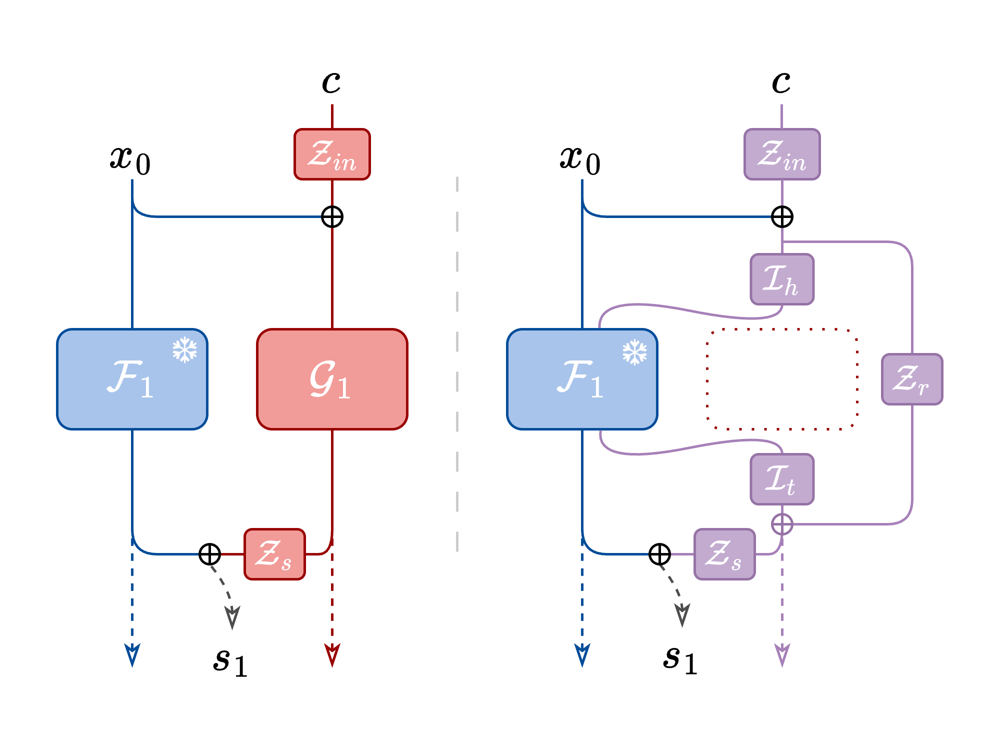

Specifically, we introduce three layers per encoder block as shown in the figure above: 
- a *Head* layer before the frozen block 
- a *Tail* layer after the frozen block 
- a *Residual* connection to preserve condition information as it passes through the frozen block

To ensure training stability, we initialize the Head and Tail layers as Identity convolutions, which mirrors the backbone's pathway from the start. The residual connection is initialized as a zero convolution, following the ControlNet methodology. This allows the conditional signal to be introduced gradually during training.

This design achieves a significant reduction in parameters while objective and subjective evaluations show it maintains comparable performance to the original ControlNet implementation. Using Diff-a-Riff as our backbone, our lightest configuration using only head layers (LiLACH) consists of only 32M parameters, a reduction of 81% compared to ControlNet's 165M parameters. On heavier architectures such as Stable Audio Open this would provide a 90% reduction from 552M down to only 57M. This extra available parameter overhead allows for flexible and modular training of multiple independent controls without retraining the backbone model.

---

## Audio Examples
This page presents a collection of randomly generated audio examples that demonstrate the capabilities of our proposed LiLAC architecture in comparison to traditional approaches. Each example consists of a 10-second audio segment generated using [Diff-a-Riff](https://arxiv.org/abs/2406.08384) as the backbone model, with a *Classifier-Free Guidance* (CFG) value of 0.25, 30 *inference steps*, and *CLAP embedding* for text conditioning.

For comprehensive comparison, we provide the following versions for each example:
- **Original reference stem** - The source audio
- **LiLACH** - Output from our lightweight head-only configuration
- **LiLACHTR** - Output from our optimal head-tail-residual configuration  
- **ControlNet** - Output from the standard ControlNet architecture
- **Unconditioned** - Output generated without additional control conditioning

Below we showcase audio examples demonstrating both conditioning types explored in our paper - Chord and Chroma conditioning. Each example demonstrates how our model responds to different types of musical control signals. For detailed technical analysis of these conditions, please refer to the full paper linked above.

### Chroma Conditioning
The chroma conditioning examples utilize chromagrams extracted directly from individual stems. Chromagrams represent the normalised intensity of different pitch classes (C, C#, D, etc.) over time, providing detailed harmonic data of the original audio. The models attempt to recreate audio with similar pitch content based on these chromagrams, while maintaining timbral characteristics specified by the CLAP embedding. 

<table>
  <thead>
    <tr>
      <th>Instrument</th>
      <th>Original</th>
      <th>LiLACH</th>
      <th>LiLACHTR</th>
      <th>ControlNet</th>
      <th>Unconditioned</th>
      <th>Chroma Condition</th>
    </tr>
  </thead>
  <tbody>
    <tr>
      <td>Woodwinds</td>
      <td><audio controls src="assets/audio/chroma/0o.mp3" class="small-audio"></audio></td>
      <td><audio controls src="assets/audio/chroma/0lh.mp3" class="small-audio"></audio></td>
      <td><audio controls src="assets/audio/chroma/0lhtr.mp3" class="small-audio"></audio></td>
      <td><audio controls src="assets/audio/chroma/0c.mp3" class="small-audio"></audio></td>
      <td><audio controls src="assets/audio/chroma/0u.mp3" class="small-audio"></audio></td>
      <td></td>
    </tr>
    <tr>
      <td>Electric Guitar</td>
      <td><audio controls src="assets/audio/chroma/3o.mp3" class="small-audio"></audio></td>
      <td><audio controls src="assets/audio/chroma/3lh.mp3" class="small-audio"></audio></td>
      <td><audio controls src="assets/audio/chroma/3lhtr.mp3" class="small-audio"></audio></td>
      <td><audio controls src="assets/audio/chroma/3c.mp3" class="small-audio"></audio></td>
      <td><audio controls src="assets/audio/chroma/3u.mp3" class="small-audio"></audio></td>
      <td>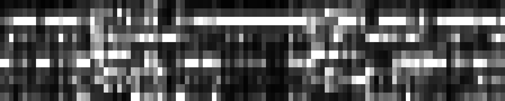</td>
    </tr>
    <tr>
      <td>Arpegiator</td>
      <td><audio controls src="assets/audio/chroma/4o.mp3" class="small-audio"></audio></td>
      <td><audio controls src="assets/audio/chroma/4lh.mp3" class="small-audio"></audio></td>
      <td><audio controls src="assets/audio/chroma/4lhtr.mp3" class="small-audio"></audio></td>
      <td><audio controls src="assets/audio/chroma/4c.mp3" class="small-audio"></audio></td>
      <td><audio controls src="assets/audio/chroma/4u.mp3" class="small-audio"></audio></td>
      <td>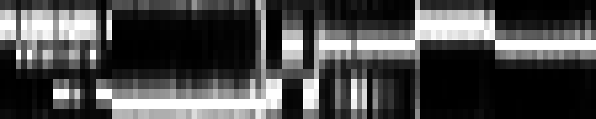</td>
    </tr>
    <tr>
      <td>Guitar</td>
      <td><audio controls src="assets/audio/chroma/6o.mp3" class="small-audio"></audio></td>
      <td><audio controls src="assets/audio/chroma/6lh.mp3" class="small-audio"></audio></td>
      <td><audio controls src="assets/audio/chroma/6lhtr.mp3" class="small-audio"></audio></td>
      <td><audio controls src="assets/audio/chroma/6c.mp3" class="small-audio"></audio></td>
      <td><audio controls src="assets/audio/chroma/6u.mp3" class="small-audio"></audio></td>
      <td>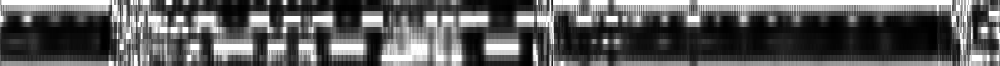</td>
    </tr>
    <tr>
      <td>Rhythm Electric Guitar</td>
      <td><audio controls src="assets/audio/chroma/8o.mp3" class="small-audio"></audio></td>
      <td><audio controls src="assets/audio/chroma/8lh.mp3" class="small-audio"></audio></td>
      <td><audio controls src="assets/audio/chroma/8lhtr.mp3" class="small-audio"></audio></td>
      <td><audio controls src="assets/audio/chroma/8c.mp3" class="small-audio"></audio></td>
      <td><audio controls src="assets/audio/chroma/8u.mp3" class="small-audio"></audio></td>
      <td>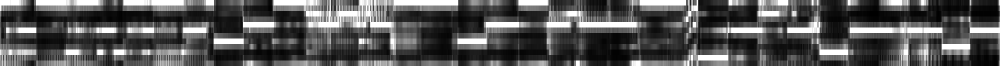</td>
    </tr>
    <tr>
      <td>Electric Guitar</td>
      <td><audio controls src="assets/audio/chroma/9o.mp3" class="small-audio"></audio></td>
      <td><audio controls src="assets/audio/chroma/9lh.mp3" class="small-audio"></audio></td>
      <td><audio controls src="assets/audio/chroma/9lhtr.mp3" class="small-audio"></audio></td>
      <td><audio controls src="assets/audio/chroma/9c.mp3" class="small-audio"></audio></td>
      <td><audio controls src="assets/audio/chroma/9u.mp3" class="small-audio"></audio></td>
      <td>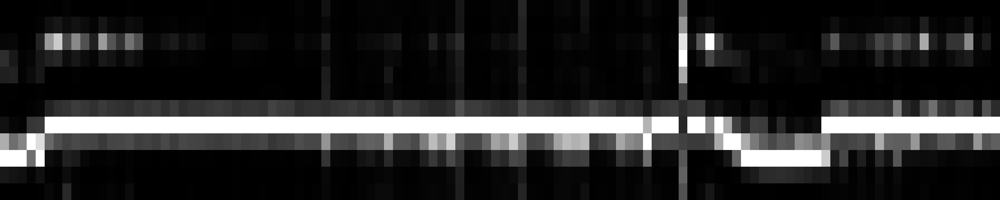</td>
    </tr>
    <tr>
      <td>Piano</td>
      <td><audio controls src="assets/audio/chroma/10o.mp3" class="small-audio"></audio></td>
      <td><audio controls src="assets/audio/chroma/10lh.mp3" class="small-audio"></audio></td>
      <td><audio controls src="assets/audio/chroma/10lhtr.mp3" class="small-audio"></audio></td>
      <td><audio controls src="assets/audio/chroma/10c.mp3" class="small-audio"></audio></td>
      <td><audio controls src="assets/audio/chroma/10u.mp3" class="small-audio"></audio></td>
      <td>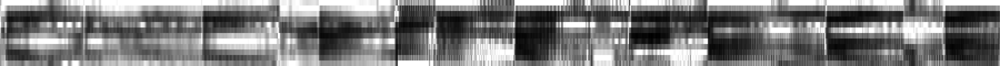</td>
    </tr>
    <tr>
      <td>Electric Guitar</td>
      <td><audio controls src="assets/audio/chroma/11o.mp3" class="small-audio"></audio></td>
      <td><audio controls src="assets/audio/chroma/11lh.mp3" class="small-audio"></audio></td>
      <td><audio controls src="assets/audio/chroma/11lhtr.mp3" class="small-audio"></audio></td>
      <td><audio controls src="assets/audio/chroma/11c.mp3" class="small-audio"></audio></td>
      <td><audio controls src="assets/audio/chroma/11u.mp3" class="small-audio"></audio></td>
      <td>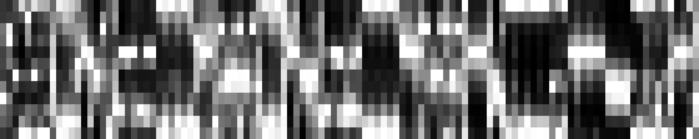</td>
    </tr>
    <tr>
      <td>Electric Bass</td>
      <td><audio controls src="assets/audio/chroma/14o.mp3" class="small-audio"></audio></td>
      <td><audio controls src="assets/audio/chroma/14lh.mp3" class="small-audio"></audio></td>
      <td><audio controls src="assets/audio/chroma/14lhtr.mp3" class="small-audio"></audio></td>
      <td><audio controls src="assets/audio/chroma/14c.mp3" class="small-audio"></audio></td>
      <td><audio controls src="assets/audio/chroma/14u.mp3" class="small-audio"></audio></td>
      <td>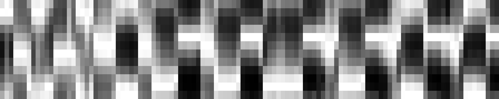</td>
    </tr>
    <tr>
      <td>Organ</td>
      <td><audio controls src="assets/audio/chroma/15o.mp3" class="small-audio"></audio></td>
      <td><audio controls src="assets/audio/chroma/15lh.mp3" class="small-audio"></audio></td>
      <td><audio controls src="assets/audio/chroma/15lhtr.mp3" class="small-audio"></audio></td>
      <td><audio controls src="assets/audio/chroma/15c.mp3" class="small-audio"></audio></td>
      <td><audio controls src="assets/audio/chroma/15u.mp3" class="small-audio"></audio></td>
      <td>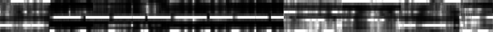</td>
    </tr>
  </tbody>
</table>

### Chord Conditioning
For chord conditioning, we extracted chord progressions from full multitrack recordings. In the audio examples, these reference chords are panned right while the generated complementary stem is panned left. The chord conditions are represented similar to chromagrams: root notes have value 2, other chord notes value 1, and non-chord notes value 0. The generated audio's instrumental characteristics are guided by CLAP embeddings.

<table>
  <thead>
    <tr>
      <th>Instrument</th>
      <th>Original</th>
      <th>LiLACH</th>
      <th>LiLACHTR</th>
      <th>ControlNet</th>
      <th>Unconditioned</th>
      <th>Chord Condition</th>
    </tr>
  </thead>
  <tbody>
    <tr>
      <td>Woodwinds</td>
      <td><audio controls src="assets/audio/chords/0o.mp3" class="small-audio"></audio></td>
      <td><audio controls src="assets/audio/chords/0lh.mp3" class="small-audio"></audio></td>
      <td><audio controls src="assets/audio/chords/0lhtr.mp3" class="small-audio"></audio></td>
      <td><audio controls src="assets/audio/chords/0c.mp3" class="small-audio"></audio></td>
      <td><audio controls src="assets/audio/chords/0u.mp3" class="small-audio"></audio></td>
      <td></td>
    </tr>
    <tr>
      <td>Piano</td>
      <td><audio controls src="assets/audio/chords/1o.mp3" class="small-audio"></audio></td>
      <td><audio controls src="assets/audio/chords/1lh.mp3" class="small-audio"></audio></td>
      <td><audio controls src="assets/audio/chords/1lhtr.mp3" class="small-audio"></audio></td>
      <td><audio controls src="assets/audio/chords/1c.mp3" class="small-audio"></audio></td>
      <td><audio controls src="assets/audio/chords/1u.mp3" class="small-audio"></audio></td>
      <td></td>
    </tr>
    <tr>
      <td>Flute</td>
      <td><audio controls src="assets/audio/chords/3o.mp3" class="small-audio"></audio></td>
      <td><audio controls src="assets/audio/chords/3lh.mp3" class="small-audio"></audio></td>
      <td><audio controls src="assets/audio/chords/3lhtr.mp3" class="small-audio"></audio></td>
      <td><audio controls src="assets/audio/chords/3c.mp3" class="small-audio"></audio></td>
      <td><audio controls src="assets/audio/chords/3u.mp3" class="small-audio"></audio></td>
      <td>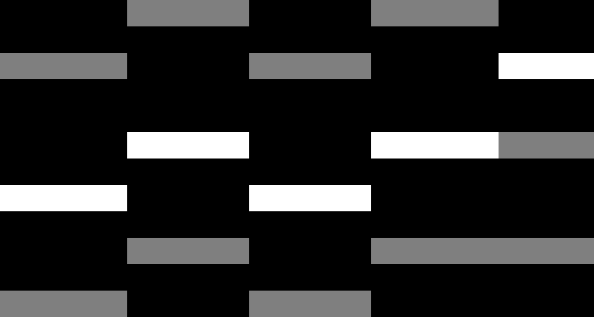</td>
    </tr>
    <tr>
      <td>Distorted Electric Guitar</td>
      <td><audio controls src="assets/audio/chords/5o.mp3" class="small-audio"></audio></td>
      <td><audio controls src="assets/audio/chords/5lh.mp3" class="small-audio"></audio></td>
      <td><audio controls src="assets/audio/chords/5lhtr.mp3" class="small-audio"></audio></td>
      <td><audio controls src="assets/audio/chords/5c.mp3" class="small-audio"></audio></td>
      <td><audio controls src="assets/audio/chords/5u.mp3" class="small-audio"></audio></td>
      <td>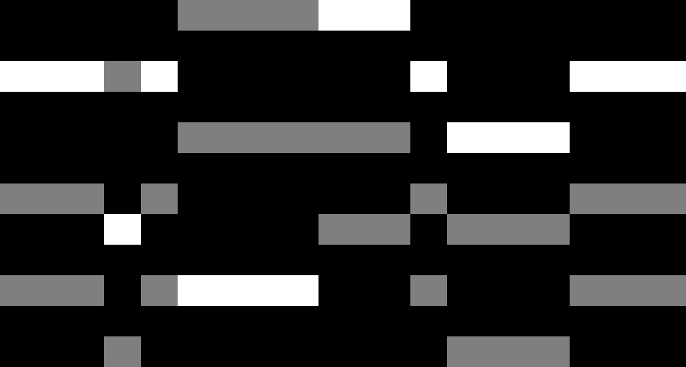</td>
    </tr>
    <tr>
      <td>String Section</td>
      <td><audio controls src="assets/audio/chords/7o.mp3" class="small-audio"></audio></td>
      <td><audio controls src="assets/audio/chords/7lh.mp3" class="small-audio"></audio></td>
      <td><audio controls src="assets/audio/chords/7lhtr.mp3" class="small-audio"></audio></td>
      <td><audio controls src="assets/audio/chords/7c.mp3" class="small-audio"></audio></td>
      <td><audio controls src="assets/audio/chords/7u.mp3" class="small-audio"></audio></td>
      <td>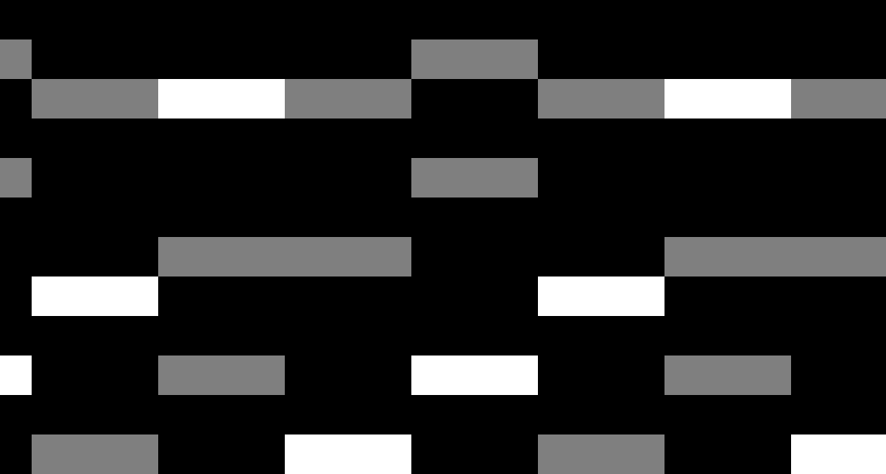</td>
    </tr>
    <tr>
      <td>Oboe</td>
      <td><audio controls src="assets/audio/chords/14o.mp3" class="small-audio"></audio></td>
      <td><audio controls src="assets/audio/chords/14lh.mp3" class="small-audio"></audio></td>
      <td><audio controls src="assets/audio/chords/14lhtr.mp3" class="small-audio"></audio></td>
      <td><audio controls src="assets/audio/chords/14c.mp3" class="small-audio"></audio></td>
      <td><audio controls src="assets/audio/chords/14u.mp3" class="small-audio"></audio></td>
      <td></td>
    </tr>
    <tr>
      <td>Hammond</td>
      <td><audio controls src="assets/audio/chords/16o.mp3" class="small-audio"></audio></td>
      <td><audio controls src="assets/audio/chords/16lh.mp3" class="small-audio"></audio></td>
      <td><audio controls src="assets/audio/chords/16lhtr.mp3" class="small-audio"></audio></td>
      <td><audio controls src="assets/audio/chords/16c.mp3" class="small-audio"></audio></td>
      <td><audio controls src="assets/audio/chords/16u.mp3" class="small-audio"></audio></td>
      <td>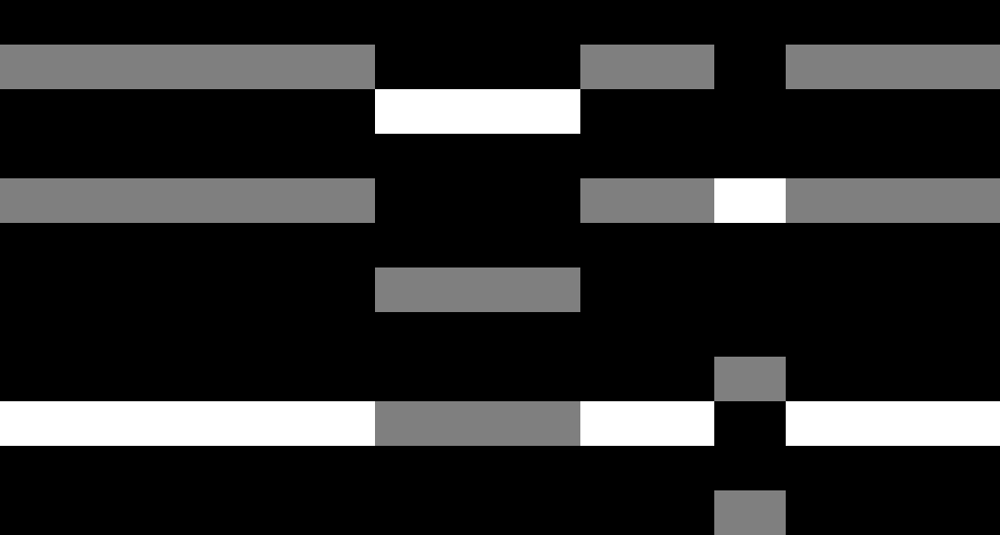</td>
    </tr>
    <tr>
      <td>Electric Guitar</td>
      <td><audio controls src="assets/audio/chords/21o.mp3" class="small-audio"></audio></td>
      <td><audio controls src="assets/audio/chords/21lh.mp3" class="small-audio"></audio></td>
      <td><audio controls src="assets/audio/chords/21lhtr.mp3" class="small-audio"></audio></td>
      <td><audio controls src="assets/audio/chords/21c.mp3" class="small-audio"></audio></td>
      <td><audio controls src="assets/audio/chords/21u.mp3" class="small-audio"></audio></td>
      <td>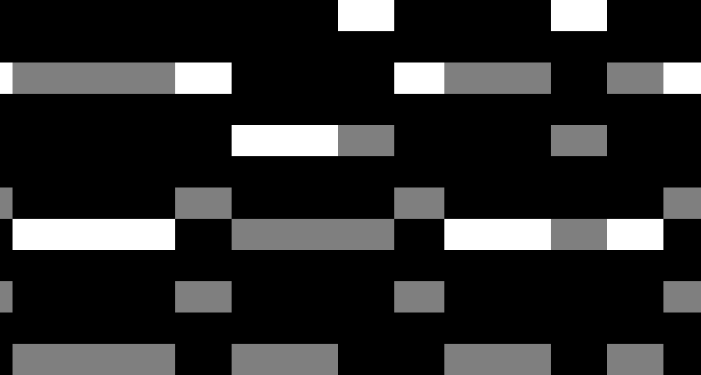</td>
    </tr>
    <tr>
      <td>Electric Piano</td>
      <td><audio controls src="assets/audio/chords/24o.mp3" class="small-audio"></audio></td>
      <td><audio controls src="assets/audio/chords/24lh.mp3" class="small-audio"></audio></td>
      <td><audio controls src="assets/audio/chords/24lhtr.mp3" class="small-audio"></audio></td>
      <td><audio controls src="assets/audio/chords/24c.mp3" class="small-audio"></audio></td>
      <td><audio controls src="assets/audio/chords/24u.mp3" class="small-audio"></audio></td>
      <td>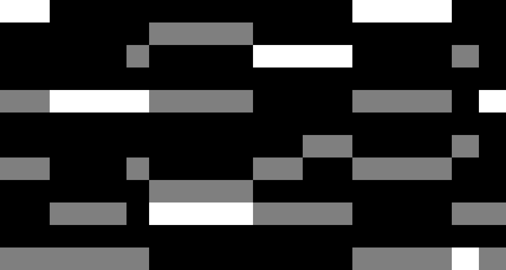</td>
    </tr>
    <tr>
      <td>Acoustic Guitar</td>
      <td><audio controls src="assets/audio/chords/27o.mp3" class="small-audio"></audio></td>
      <td><audio controls src="assets/audio/chords/27lh.mp3" class="small-audio"></audio></td>
      <td><audio controls src="assets/audio/chords/27lhtr.mp3" class="small-audio"></audio></td>
      <td><audio controls src="assets/audio/chords/27c.mp3" class="small-audio"></audio></td>
      <td><audio controls src="assets/audio/chords/27u.mp3" class="small-audio"></audio></td>
      <td>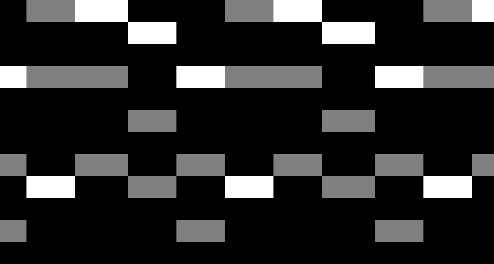</td>
    </tr>
    <tr>
      <td>Acoustic Guitar</td>
      <td><audio controls src="assets/audio/chords/32o.mp3" class="small-audio"></audio></td>
      <td><audio controls src="assets/audio/chords/32lh.mp3" class="small-audio"></audio></td>
      <td><audio controls src="assets/audio/chords/32lhtr.mp3" class="small-audio"></audio></td>
      <td><audio controls src="assets/audio/chords/32c.mp3" class="small-audio"></audio></td>
      <td><audio controls src="assets/audio/chords/32u.mp3" class="small-audio"></audio></td>
      <td>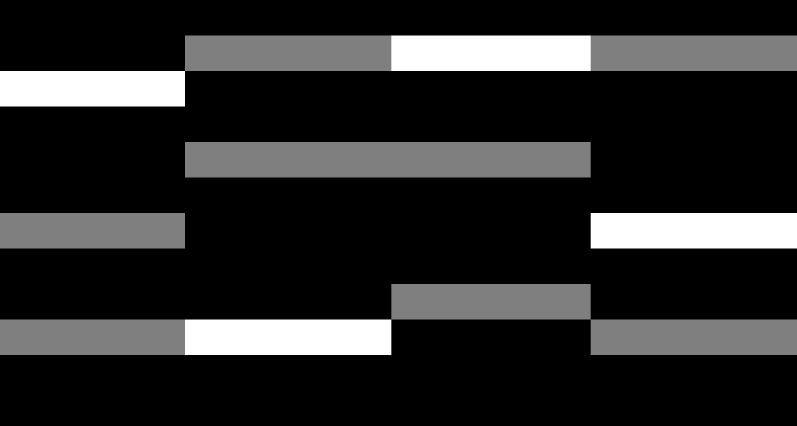</td>
    </tr>
    <tr>
      <td>Synthesizer</td>
      <td><audio controls src="assets/audio/chords/33o.mp3" class="small-audio"></audio></td>
      <td><audio controls src="assets/audio/chords/33lh.mp3" class="small-audio"></audio></td>
      <td><audio controls src="assets/audio/chords/33lhtr.mp3" class="small-audio"></audio></td>
      <td><audio controls src="assets/audio/chords/33c.mp3" class="small-audio"></audio></td>
      <td><audio controls src="assets/audio/chords/33u.mp3" class="small-audio"></audio></td>
      <td>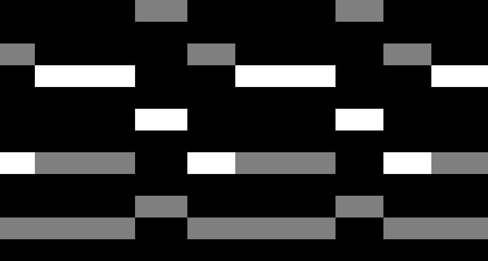</td>
    </tr>
    <tr>
      <td>Fiddle</td>
      <td><audio controls src="assets/audio/chords/34o.mp3" class="small-audio"></audio></td>
      <td><audio controls src="assets/audio/chords/34lh.mp3" class="small-audio"></audio></td>
      <td><audio controls src="assets/audio/chords/34lhtr.mp3" class="small-audio"></audio></td>
      <td><audio controls src="assets/audio/chords/34c.mp3" class="small-audio"></audio></td>
      <td><audio controls src="assets/audio/chords/34u.mp3" class="small-audio"></audio></td>
      <td>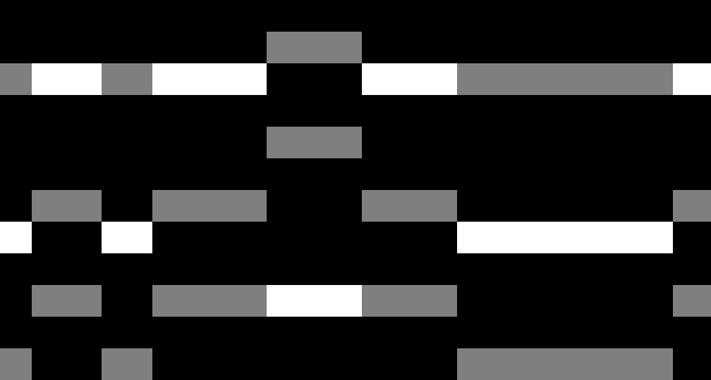</td>
    </tr>
    <tr>
      <td>Electric Bass</td>
      <td><audio controls src="assets/audio/chords/37o.mp3" class="small-audio"></audio></td>
      <td><audio controls src="assets/audio/chords/37lh.mp3" class="small-audio"></audio></td>
      <td><audio controls src="assets/audio/chords/37lhtr.mp3" class="small-audio"></audio></td>
      <td><audio controls src="assets/audio/chords/37c.mp3" class="small-audio"></audio></td>
      <td><audio controls src="assets/audio/chords/37u.mp3" class="small-audio"></audio></td>
      <td>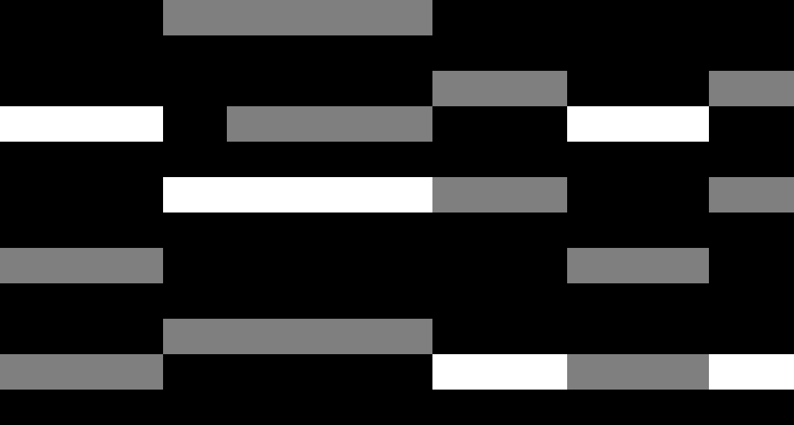</td>
    </tr>
    <tr>
      <td>Upright Bass</td>
      <td><audio controls src="assets/audio/chords/38o.mp3" class="small-audio"></audio></td>
      <td><audio controls src="assets/audio/chords/38lh.mp3" class="small-audio"></audio></td>
      <td><audio controls src="assets/audio/chords/38lhtr.mp3" class="small-audio"></audio></td>
      <td><audio controls src="assets/audio/chords/38c.mp3" class="small-audio"></audio></td>
      <td><audio controls src="assets/audio/chords/38u.mp3" class="small-audio"></audio></td>
      <td>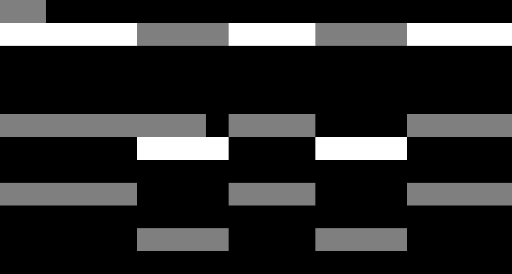</td>
    </tr>
  </tbody>
</table>
