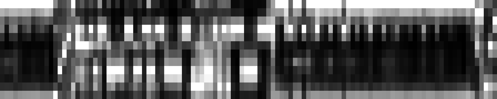
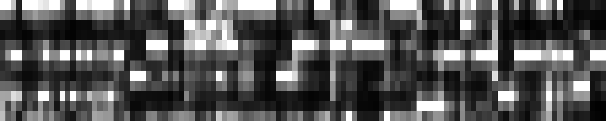
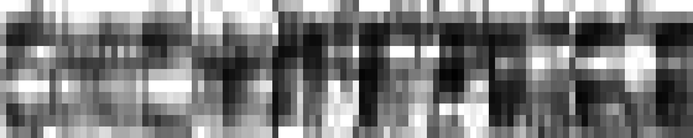
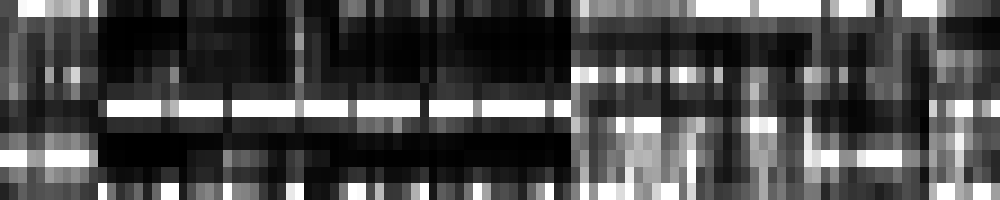

## Abstract
Text-to-audio diffusion models produce high-quality and diverse music but lack fine-grained, time-varying controls, which are essential for music production. ControlNet enables attaching external controls to a pre-trained generative model by cloning and fine-tuning its encoder on new conditionings. However, this approach incurs a large memory footprint and restricts users to a fixed set of controls. We propose a lightweight, modular architecture that considerably reduces parameter count while matching ControlNet in audio quality and condition adherence. Our method offers greater flexibility and significantly lower memory usage, enabling more efficient training and deployment of independent controls. We conduct extensive objective and subjective evaluations, see complete paper for more details.

---

## Architecture Overview

    

Here is a outline showing how the LiLAC architecture compares to ControlNet. Instead of the cloning encoder blocks of the backbone model we intend to append controls to, we instead  perform a second pass through each of the models frozen encoder blocks, wrapped by smaller convolutional layers. 

Specifically, we introduce three layers per block: 
- a *Head* layer before the frozen block 
- a *Tail* layer after the frozen block 
- a *Residual* connection to preserve condition information as it passes through the frozen block

This design achieves a significant reduction in parameters while maintaining comparable performance to the original ControlNet implementation. Utilising Diff-a-Riff as our backbone model, our lightest configuration using only head layers (LiLACH) consists of only 32M parameters compared to ControlNet's 165M parameters.

---

## Audio Examples
This page presents a collection of audio examples that demonstrate the capabilities of our proposed LiLAC architecture in comparison to traditional approaches. Each example consists of a 10-second audio segment generated using [Diff-a-Riff](https://arxiv.org/abs/2406.08384) as the backbone model, with a *Classifier-Free Guidance* (CFG) value of 0.25, 30 *inference steps*, and *CLAP embedding* for text conditioning.

For comprehensive comparison, we provide the following versions of each example:
- The original reference stem
- Output generated using our lightweight LiLACH configuration
- Output generated using our optimal LiLACHTR configuration
- Output generated using the standard ControlNet architecture
- Output generated without additional control conditioning (Unconditioned)

We provide examples from both conditions used in the paper - Chord and Chroma conditioning. We provide a brief description below, for more information, please check out the paper linked at the top of the page.

### Chord
For the chord conditioning examples, we extracted chord progressions from complete multitrack recordings (panned to the right in the audio examples). These chord progressions were then used to guide the generation of a complementary stem, with instrument classification informed by the CLAP embedding of the target stem.

<table>
  <thead>
    <tr>
      <th>Instrument</th>
      <th>Original</th>
      <th>LiLACH</th>
      <th>LiLACHTR</th>
      <th>ControlNet</th>
      <th>Unconditioned</th>
      <th>Chord Condition</th>
    </tr>
  </thead>
  <tbody>
    <tr>
      <td>Woodwinds</td>
      <td><audio controls src="assets/audio/chords/0o.mp3" class="small-audio"></audio></td>
      <td><audio controls src="assets/audio/chords/0lh.mp3" class="small-audio"></audio></td>
      <td><audio controls src="assets/audio/chords/0lhtr.mp3" class="small-audio"></audio></td>
      <td><audio controls src="assets/audio/chords/0c.mp3" class="small-audio"></audio></td>
      <td><audio controls src="assets/audio/chords/0u.mp3" class="small-audio"></audio></td>
      <td></td>
    </tr>
    <tr>
      <td>Piano</td>
      <td><audio controls src="assets/audio/chords/1o.mp3" class="small-audio"></audio></td>
      <td><audio controls src="assets/audio/chords/1lh.mp3" class="small-audio"></audio></td>
      <td><audio controls src="assets/audio/chords/1lhtr.mp3" class="small-audio"></audio></td>
      <td><audio controls src="assets/audio/chords/1c.mp3" class="small-audio"></audio></td>
      <td><audio controls src="assets/audio/chords/1u.mp3" class="small-audio"></audio></td>
      <td></td>
    </tr>
    <tr>
      <td>Flute</td>
      <td><audio controls src="assets/audio/chords/3o.mp3" class="small-audio"></audio></td>
      <td><audio controls src="assets/audio/chords/3lh.mp3" class="small-audio"></audio></td>
      <td><audio controls src="assets/audio/chords/3lhtr.mp3" class="small-audio"></audio></td>
      <td><audio controls src="assets/audio/chords/3c.mp3" class="small-audio"></audio></td>
      <td><audio controls src="assets/audio/chords/3u.mp3" class="small-audio"></audio></td>
      <td></td>
    </tr>
    <tr>
      <td>Distorted Electric Guitar</td>
      <td><audio controls src="assets/audio/chords/5o.mp3" class="small-audio"></audio></td>
      <td><audio controls src="assets/audio/chords/5lh.mp3" class="small-audio"></audio></td>
      <td><audio controls src="assets/audio/chords/5lhtr.mp3" class="small-audio"></audio></td>
      <td><audio controls src="assets/audio/chords/5c.mp3" class="small-audio"></audio></td>
      <td><audio controls src="assets/audio/chords/5u.mp3" class="small-audio"></audio></td>
      <td></td>
    </tr>
    <tr>
      <td>String Section</td>
      <td><audio controls src="assets/audio/chords/7o.mp3" class="small-audio"></audio></td>
      <td><audio controls src="assets/audio/chords/7lh.mp3" class="small-audio"></audio></td>
      <td><audio controls src="assets/audio/chords/7lhtr.mp3" class="small-audio"></audio></td>
      <td><audio controls src="assets/audio/chords/7c.mp3" class="small-audio"></audio></td>
      <td><audio controls src="assets/audio/chords/7u.mp3" class="small-audio"></audio></td>
      <td></td>
    </tr>
    <tr>
      <td>Oboe</td>
      <td><audio controls src="assets/audio/chords/14o.mp3" class="small-audio"></audio></td>
      <td><audio controls src="assets/audio/chords/14lh.mp3" class="small-audio"></audio></td>
      <td><audio controls src="assets/audio/chords/14lhtr.mp3" class="small-audio"></audio></td>
      <td><audio controls src="assets/audio/chords/14c.mp3" class="small-audio"></audio></td>
      <td><audio controls src="assets/audio/chords/14u.mp3" class="small-audio"></audio></td>
      <td></td>
    </tr>
    <tr>
      <td>Hammond</td>
      <td><audio controls src="assets/audio/chords/16o.mp3" class="small-audio"></audio></td>
      <td><audio controls src="assets/audio/chords/16lh.mp3" class="small-audio"></audio></td>
      <td><audio controls src="assets/audio/chords/16lhtr.mp3" class="small-audio"></audio></td>
      <td><audio controls src="assets/audio/chords/16c.mp3" class="small-audio"></audio></td>
      <td><audio controls src="assets/audio/chords/16u.mp3" class="small-audio"></audio></td>
      <td></td>
    </tr>
    <tr>
      <td>Electric Guitar</td>
      <td><audio controls src="assets/audio/chords/21o.mp3" class="small-audio"></audio></td>
      <td><audio controls src="assets/audio/chords/21lh.mp3" class="small-audio"></audio></td>
      <td><audio controls src="assets/audio/chords/21lhtr.mp3" class="small-audio"></audio></td>
      <td><audio controls src="assets/audio/chords/21c.mp3" class="small-audio"></audio></td>
      <td><audio controls src="assets/audio/chords/21u.mp3" class="small-audio"></audio></td>
      <td></td>
    </tr>
    <tr>
      <td>Electric Piano</td>
      <td><audio controls src="assets/audio/chords/24o.mp3" class="small-audio"></audio></td>
      <td><audio controls src="assets/audio/chords/24lh.mp3" class="small-audio"></audio></td>
      <td><audio controls src="assets/audio/chords/24lhtr.mp3" class="small-audio"></audio></td>
      <td><audio controls src="assets/audio/chords/24c.mp3" class="small-audio"></audio></td>
      <td><audio controls src="assets/audio/chords/24u.mp3" class="small-audio"></audio></td>
      <td></td>
    </tr>
    <tr>
      <td>Acoustic Guitar</td>
      <td><audio controls src="assets/audio/chords/27o.mp3" class="small-audio"></audio></td>
      <td><audio controls src="assets/audio/chords/27lh.mp3" class="small-audio"></audio></td>
      <td><audio controls src="assets/audio/chords/27lhtr.mp3" class="small-audio"></audio></td>
      <td><audio controls src="assets/audio/chords/27c.mp3" class="small-audio"></audio></td>
      <td><audio controls src="assets/audio/chords/27u.mp3" class="small-audio"></audio></td>
      <td></td>
    </tr>
    <tr>
      <td>Acoustic Guitar</td>
      <td><audio controls src="assets/audio/chords/32o.mp3" class="small-audio"></audio></td>
      <td><audio controls src="assets/audio/chords/32lh.mp3" class="small-audio"></audio></td>
      <td><audio controls src="assets/audio/chords/32lhtr.mp3" class="small-audio"></audio></td>
      <td><audio controls src="assets/audio/chords/32c.mp3" class="small-audio"></audio></td>
      <td><audio controls src="assets/audio/chords/32u.mp3" class="small-audio"></audio></td>
      <td></td>
    </tr>
    <tr>
      <td>Synthesizer</td>
      <td><audio controls src="assets/audio/chords/33o.mp3" class="small-audio"></audio></td>
      <td><audio controls src="assets/audio/chords/33lh.mp3" class="small-audio"></audio></td>
      <td><audio controls src="assets/audio/chords/33lhtr.mp3" class="small-audio"></audio></td>
      <td><audio controls src="assets/audio/chords/33c.mp3" class="small-audio"></audio></td>
      <td><audio controls src="assets/audio/chords/33u.mp3" class="small-audio"></audio></td>
      <td></td>
    </tr>
    <tr>
      <td>Fiddle</td>
      <td><audio controls src="assets/audio/chords/34o.mp3" class="small-audio"></audio></td>
      <td><audio controls src="assets/audio/chords/34lh.mp3" class="small-audio"></audio></td>
      <td><audio controls src="assets/audio/chords/34lhtr.mp3" class="small-audio"></audio></td>
      <td><audio controls src="assets/audio/chords/34c.mp3" class="small-audio"></audio></td>
      <td><audio controls src="assets/audio/chords/34u.mp3" class="small-audio"></audio></td>
      <td></td>
    </tr>
    <tr>
      <td>Electric Bass</td>
      <td><audio controls src="assets/audio/chords/37o.mp3" class="small-audio"></audio></td>
      <td><audio controls src="assets/audio/chords/37lh.mp3" class="small-audio"></audio></td>
      <td><audio controls src="assets/audio/chords/37lhtr.mp3" class="small-audio"></audio></td>
      <td><audio controls src="assets/audio/chords/37c.mp3" class="small-audio"></audio></td>
      <td><audio controls src="assets/audio/chords/37u.mp3" class="small-audio"></audio></td>
      <td></td>
    </tr>
    <tr>
      <td>Upright Bass</td>
      <td><audio controls src="assets/audio/chords/38o.mp3" class="small-audio"></audio></td>
      <td><audio controls src="assets/audio/chords/38lh.mp3" class="small-audio"></audio></td>
      <td><audio controls src="assets/audio/chords/38lhtr.mp3" class="small-audio"></audio></td>
      <td><audio controls src="assets/audio/chords/38c.mp3" class="small-audio"></audio></td>
      <td><audio controls src="assets/audio/chords/38u.mp3" class="small-audio"></audio></td>
      <td></td>
    </tr>
  </tbody>
</table>

### Chroma
The chroma conditioning examples utilize chromagrams extracted directly from individual stems. The models attempt to recreate audio with similar pitch content based on these chromagrams.

<table>
  <thead>
    <tr>
      <th>Instrument</th>
      <th>Original</th>
      <th>LiLACH</th>
      <th>LiLACHTR</th>
      <th>ControlNet</th>
      <th>Unconditioned</th>
      <th>Chroma Condition</th>
    </tr>
  </thead>
  <tbody>
    <tr>
      <td>Woodwinds</td>
      <td><audio controls src="assets/audio/chroma/0o.mp3" class="small-audio"></audio></td>
      <td><audio controls src="assets/audio/chroma/0lh.mp3" class="small-audio"></audio></td>
      <td><audio controls src="assets/audio/chroma/0lhtr.mp3" class="small-audio"></audio></td>
      <td><audio controls src="assets/audio/chroma/0c.mp3" class="small-audio"></audio></td>
      <td><audio controls src="assets/audio/chroma/0u.mp3" class="small-audio"></audio></td>
      <td></td>
    </tr>
    <tr>
      <td>Electric Guitar</td>
      <td><audio controls src="assets/audio/chroma/3o.mp3" class="small-audio"></audio></td>
      <td><audio controls src="assets/audio/chroma/3lh.mp3" class="small-audio"></audio></td>
      <td><audio controls src="assets/audio/chroma/3lhtr.mp3" class="small-audio"></audio></td>
      <td><audio controls src="assets/audio/chroma/3c.mp3" class="small-audio"></audio></td>
      <td><audio controls src="assets/audio/chroma/3u.mp3" class="small-audio"></audio></td>
      <td></td>
    </tr>
    <tr>
      <td>Arpegiator</td>
      <td><audio controls src="assets/audio/chroma/4o.mp3" class="small-audio"></audio></td>
      <td><audio controls src="assets/audio/chroma/4lh.mp3" class="small-audio"></audio></td>
      <td><audio controls src="assets/audio/chroma/4lhtr.mp3" class="small-audio"></audio></td>
      <td><audio controls src="assets/audio/chroma/4c.mp3" class="small-audio"></audio></td>
      <td><audio controls src="assets/audio/chroma/4u.mp3" class="small-audio"></audio></td>
      <td></td>
    </tr>
    <tr>
      <td>Guitar</td>
      <td><audio controls src="assets/audio/chroma/6o.mp3" class="small-audio"></audio></td>
      <td><audio controls src="assets/audio/chroma/6lh.mp3" class="small-audio"></audio></td>
      <td><audio controls src="assets/audio/chroma/6lhtr.mp3" class="small-audio"></audio></td>
      <td><audio controls src="assets/audio/chroma/6c.mp3" class="small-audio"></audio></td>
      <td><audio controls src="assets/audio/chroma/6u.mp3" class="small-audio"></audio></td>
      <td></td>
    </tr>
    <tr>
      <td>Rhythm Electric Guitar</td>
      <td><audio controls src="assets/audio/chroma/8o.mp3" class="small-audio"></audio></td>
      <td><audio controls src="assets/audio/chroma/8lh.mp3" class="small-audio"></audio></td>
      <td><audio controls src="assets/audio/chroma/8lhtr.mp3" class="small-audio"></audio></td>
      <td><audio controls src="assets/audio/chroma/8c.mp3" class="small-audio"></audio></td>
      <td><audio controls src="assets/audio/chroma/8u.mp3" class="small-audio"></audio></td>
      <td></td>
    </tr>
    <tr>
      <td>Electric Guitar</td>
      <td><audio controls src="assets/audio/chroma/9o.mp3" class="small-audio"></audio></td>
      <td><audio controls src="assets/audio/chroma/9lh.mp3" class="small-audio"></audio></td>
      <td><audio controls src="assets/audio/chroma/9lhtr.mp3" class="small-audio"></audio></td>
      <td><audio controls src="assets/audio/chroma/9c.mp3" class="small-audio"></audio></td>
      <td><audio controls src="assets/audio/chroma/9u.mp3" class="small-audio"></audio></td>
      <td></td>
    </tr>
    <tr>
      <td>Piano</td>
      <td><audio controls src="assets/audio/chroma/10o.mp3" class="small-audio"></audio></td>
      <td><audio controls src="assets/audio/chroma/10lh.mp3" class="small-audio"></audio></td>
      <td><audio controls src="assets/audio/chroma/10lhtr.mp3" class="small-audio"></audio></td>
      <td><audio controls src="assets/audio/chroma/10c.mp3" class="small-audio"></audio></td>
      <td><audio controls src="assets/audio/chroma/10u.mp3" class="small-audio"></audio></td>
      <td></td>
    </tr>
    <tr>
      <td>Electric Guitar</td>
      <td><audio controls src="assets/audio/chroma/11o.mp3" class="small-audio"></audio></td>
      <td><audio controls src="assets/audio/chroma/11lh.mp3" class="small-audio"></audio></td>
      <td><audio controls src="assets/audio/chroma/11lhtr.mp3" class="small-audio"></audio></td>
      <td><audio controls src="assets/audio/chroma/11c.mp3" class="small-audio"></audio></td>
      <td><audio controls src="assets/audio/chroma/11u.mp3" class="small-audio"></audio></td>
      <td></td>
    </tr>
    <tr>
      <td>Electric Bass</td>
      <td><audio controls src="assets/audio/chroma/14o.mp3" class="small-audio"></audio></td>
      <td><audio controls src="assets/audio/chroma/14lh.mp3" class="small-audio"></audio></td>
      <td><audio controls src="assets/audio/chroma/14lhtr.mp3" class="small-audio"></audio></td>
      <td><audio controls src="assets/audio/chroma/14c.mp3" class="small-audio"></audio></td>
      <td><audio controls src="assets/audio/chroma/14u.mp3" class="small-audio"></audio></td>
      <td></td>
    </tr>
    <tr>
      <td>Organ</td>
      <td><audio controls src="assets/audio/chroma/15o.mp3" class="small-audio"></audio></td>
      <td><audio controls src="assets/audio/chroma/15lh.mp3" class="small-audio"></audio></td>
      <td><audio controls src="assets/audio/chroma/15lhtr.mp3" class="small-audio"></audio></td>
      <td><audio controls src="assets/audio/chroma/15c.mp3" class="small-audio"></audio></td>
      <td><audio controls src="assets/audio/chroma/15u.mp3" class="small-audio"></audio></td>
      <td></td>
    </tr>
  </tbody>
</table>
